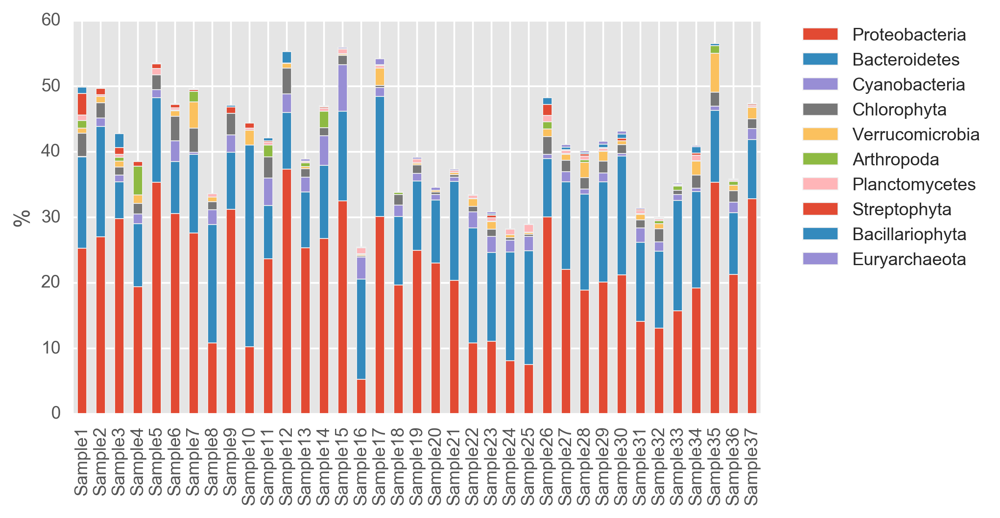
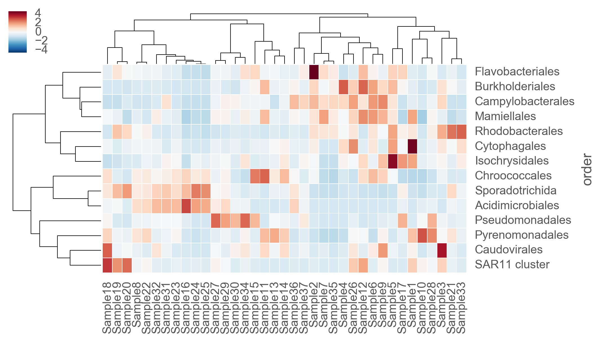

   
     

# biovisualize
Interactive toolkit to produce high-quality graphs of results from sequencing projects

## Installation
These jupyter notebooks can be downloaded and run separately but they all assume data for plotting is in a directory called 'datadir'. To make sure you have all the Python packages required you can use [Conda](http://conda.pydata.org/docs/download.html) and download the [bio.yml](https://raw.githubusercontent.com/johnne/biovisualize/master/python_envs/bio.yml) (for Python 2.7) or [bio35.yml](https://raw.githubusercontent.com/johnne/biovisualize/master/python_envs/bio35.yml) (for Python 3.5) environment files. Then create the environments using:

Python 2.7

`conda env create -f bio.yml`

Python 3.5

`conda env create -f bio35.yml`

Activate the environment with:

`source activate bio` or `source activate bio35` depending on your choice.

## Setting up Plotly
To use the plotly notebooks you need to create a (free) account at [plot.ly](https://plot.ly/). Then see the ["Getting Started with Plotly for Python"](https://plot.ly/python/getting-started/) instructions on how to set up plotly on your computer.
